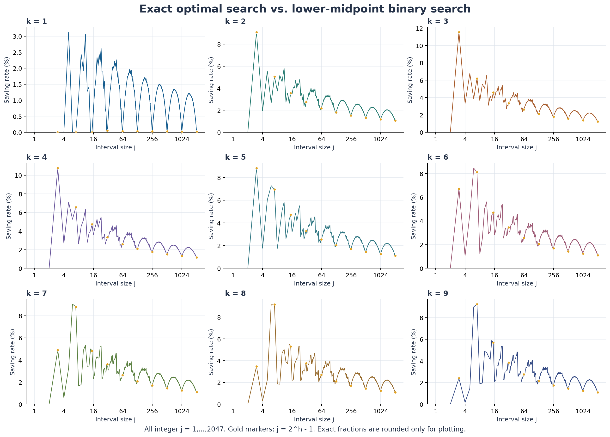
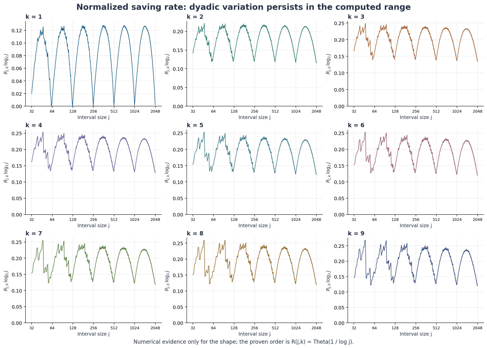

# 질문값 의존 비용 환경의 최적 탐색

정렬된 정수 후보에서 질문값에 따라 비용이 달라질 때, 고전 이진 탐색과
최소 기대비용 탐색을 정확하게 비교하는 R&E 연구의 계산 코드와 보충자료이다.

## 모형과 계산 범위

- 목표값은 `{1, ..., j}`에서 균등하게 선택한다.
- 질문값 `q`를 선택하면 `q^k`를 지불한다. 정답을 확인하는 마지막 질문도 포함한다.
- 비교 기준은 **작은 쪽 중앙값** `floor((a+b)/2)`을 선택하는 이진 탐색이다.
- 제공 데이터: 모든 `1 <= j <= 2047`, `1 <= k <= 9`의 18,423개 조합.
- 전체 비용 계산은 **C++17**, 독립 검산·분수 계산·그래프 작성은 **Python**으로 수행하였다.
- 큰 정수는 JSON 문자열로 보존한다. 계산은 정수와 기약분수로 하고, 그래프를 그릴 때만 실수로 변환한다.

## 파일 구성

| 경로 | 역할 |
|---|---|
| `src/exact_search.cpp` | 전체 구간에 대한 정확한 C++ 동적 계획법 |
| `scripts/query.py` | 제공 데이터 조회 / Python 임의정밀도 DP 재계산 |
| `scripts/plot.py` | 절감률 및 정규화 절감률 그래프 생성 |
| `scripts/verify.py` | 전체 데이터 검산, 작은 구간의 모든 트리 열거, C++/Python 대조 |
| `data/exact_results.jsonl.gz` | 전체 정확값·기약분수·모멘트·계수 (gzip) |
| `data/computed_summary.json` | 대표값 및 유한 범위 통계 |
| `figures/` | PNG/SVG 그래프 |
| `docs/math_notes.md` | 정확한 계산식, 개선 전략, 점근적 분석 |

## 빠른 실행

터미널을 이 저장소의 최상위 폴더에서 연다. Windows에서 `python` 대신 `py`를 사용할 수 있다.

```bash
python -m pip install -r requirements.txt
python scripts/query.py 100 9
python scripts/query.py 31 1 --compute
python scripts/verify.py
python scripts/plot.py
```

`query.py`는 기본적으로 이미 계산된 결과를 읽는다. `--compute`를 지정하면
Python 정수 DP로 해당 구간을 처음부터 계산한다. 큰 j에서는 매우 오래 걸릴 수 있다.
`plot.py`는 gzip 데이터를 직접 읽으므로 사용자가 압축을 풀 필요가 없다.

## 전체 데이터를 처음부터 계산

GCC 또는 signed `__int128`을 지원하는 Clang이 필요하다. MSVC는 이 소스를 그대로 컴파일할 수 없다.

```bash
mkdir build
g++ -O3 -std=c++17 src/exact_search.cpp -o build/exact_search
./build/exact_search 2047 data/recomputed.jsonl
python scripts/verify.py --recomputed data/recomputed.jsonl
python scripts/plot.py --data data/recomputed.jsonl
```

Windows MinGW에서는 출력 이름을 `build/exact_search.exe`로 지정하고
`./build/exact_search.exe`로 실행한다. 전체 재계산의 후보 평가 횟수는 약 129억 회이므로
먼저 N=8 또는 N=100으로 실행을 확인하는 편이 좋다.

```bash
./build/exact_search 8 build/small.jsonl
python scripts/verify.py --recomputed build/small.jsonl
```

전체 최적화의 시간 복잡도는 `O(9N^3)`, k 하나를 처리할 때의 메모리는 `O(N^2)`이다.
분석한 질문비용에는 이 전략 구성의 전처리 시간은 포함하지 않는다.

## 정확한 계산식

빈 구간에서 C와 G는 0이다. 구간 길이를 n=b-a+1로 쓰면

```text
C_k(a,b) = min_{a<=q<=b} [n*q^k + C_k(a,q-1) + C_k(q+1,b)]
G_k(a,b) = n*m^k + G_k(a,m-1) + G_k(m+1,b), m=floor((a+b)/2)
E(j,k)   = C_k(1,j)/j
B(j,k)   = G_k(1,j)/j
Delta    = (G_k(1,j)-C_k(1,j))/j
R        = (G_k(1,j)-C_k(1,j))/G_k(1,j)
```

동률이면 총 질문 횟수가 작은 트리를 선택하고, 다시 동률이면 가장 작은 루트를 재귀적으로 선택한다.
이 규칙은 최소 비용에는 영향을 주지 않지만 모멘트와 트리 구조를 재현 가능하게 한다.

## 데이터 읽기

각 행은 하나의 (j,k) 조합이다. `optimal_sum`, `binary_sum`은 각각 모든 목표값에 대한
총비용이므로 **기대비용은 j로 나누어야 한다**. `saving_rate`는 비율이며 백분율은 100배이다.
`root`는 선택된 최적 트리의 첫 질문값이다.

`moments[r] = sum_q s_T(q)*(j-q)^r`이며, 총비용의 계수는
`(-1)^r * comb(k,r) * moments[r]`이다. 제공된 계수들은 높은 차수부터 저장한다.
모멘트와 계수는 j,k 및 선택된 트리에 의존하므로 모든 j에 적용되는 고정된 다항식의 계수가 아니다.

최적 비용 트리의 총 질문 횟수 M0는 질문 횟수 자체의 최솟값과 같을 필요가 없다.
예를 들어 (j,k)=(31,1)에서 최적 트리는 총 질문 횟수 136, 총비용 2063이며,
고전 이진 탐색은 각각 129, 2064이다.

## 결과 해석

각각의 고정된 k=1,...,9에서 기대비용의 주항은 `j^k log2(j)/(k+1)`이다.
절감액은 `Theta_k(j^k)`, 절감률은 `Theta_k(1/log j)`이다.
따라서 절감액은 무한히 증가하고 절감률은 0으로 수렴한다. 절감률은 j나 k에 대해 단조롭지 않다.
로그축에서 관찰한 반복성이나 `R log2(j)`의 극한 존재는 증명된 결과로 주장하지 않는다.
증명과 정확한 유한 구간 하한은 [수학적 보충자료](docs/math_notes.md)를 참고한다.




## 검증 범위

전체 18,423개 행의 모멘트 전개, 저장된 계수·기약분수 및 고전 이진 탐색 비용을 검산한다.
j<=8에서는 가능한 모든 이진 탐색 트리를 열거하여 최소 비용을 비교한다.
C++ 재계산 파일을 제공하면 모든 해당 행을 제공 데이터와 대조하고,
그중 j<=8은 독립적인 Python DP와도 대조한다.
작은 구간의 완전 열거 검증이 큰 구간까지 완전 열거했다는 뜻은 아니다.

## 참고문헌

- Knight, W. J. (1988). Search in an ordered array having variable probe cost.
  SIAM Journal on Computing, 17(6), 1203–1214. https://doi.org/10.1137/0217076
- Knuth, D. E. (1971). Optimum binary search trees.
  Acta Informatica, 1, 14–25. https://doi.org/10.1007/BF00264289
- Laber, E. S., Milidiú, R. L., & Pessoa, A. A. (2002). On binary searching with nonuniform costs.
  SIAM Journal on Computing, 31(4), 1022–1047. https://doi.org/10.1137/S0097539700381991

## 제출 버전

제출용 버전: v1.0.0. 논문에는 공개 후 이 버전의 릴리스 URL을 기재한다.
저장소에 논문 원문, 연락처, 컴파일된 실행 파일은 포함하지 않는다.
